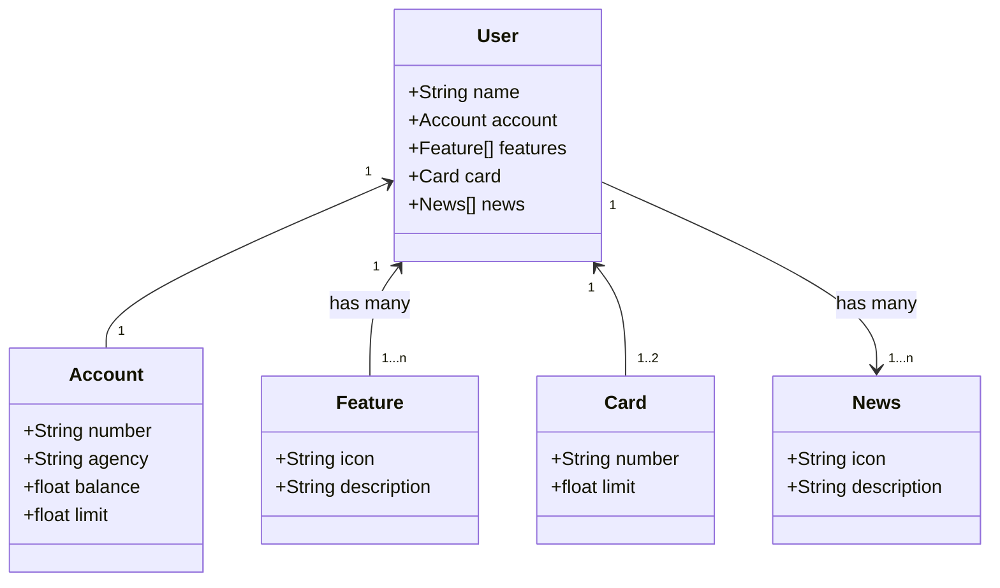

# API Software para gestão de caixa 

# Diagramação

```mermaid
classDiagram
    class User {
        +String name
        +Account account
        +Feature[] features
        +Card card
        +News[] news
    }

    class Account {
        +String number
        +String agency
        +float balance
        +float limit
    }

    class Feature {
        +String icon
        +String description
    }

    class Card {
        +String number
        +float limit
    }

    class News {
        +String icon
        +String description
    }

    User "1" <-- "1" Account
    User "1" <-- "1...n" Feature : has many
    User "1" <-- "1..2" Card
    User "1" --> "1...n" News : has many

```
